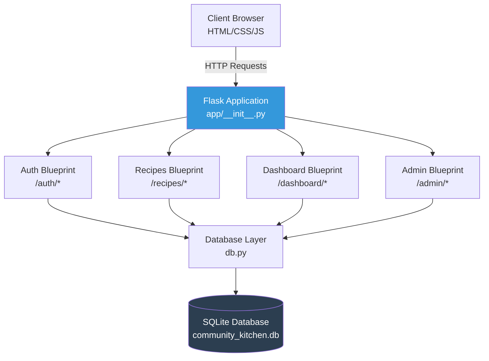

# Open Kitchen - Recipe Sharing Application

A collaborative recipe management system designed for community and family environments, built with Flask and SQLite.

## Features

- **User Authentication**: Secure registration and login system with role-based access (Contributor, Curator)
- **Recipe Management**: Create, view, and fork recipes with structured ingredient data
- **Dynamic Scaling**: Automatically scale ingredient quantities for different serving sizes
- **Recipe Templates**: Support for Standard Recipes and Quick Tips
- **Social Features**: Reviews, comments, and recipe saving
- **Personal Dashboard**: "My Kitchen" view with authored, forked, and saved recipes
- **Admin Tools**: User management, allergen audits, fork reports, and activity tracking
- **Notifications**: Event-triggered notifications for recipe interactions

## Project Structure

```
open-kitchen/
├── app/
│   ├── __init__.py          # Application factory
│   ├── auth.py              # Authentication blueprint
│   ├── recipes.py           # Recipe management blueprint
│   ├── dashboard.py         # User dashboard blueprint
│   ├── admin.py             # Admin tools blueprint
│   ├── db.py                # Database connection and initialization
│   ├── schema.sql           # Database schema with seed data
│   └── templates/           # Jinja2 templates
│       ├── base.html
│       ├── auth/
│       ├── recipes/
│       ├── dashboard/
│       └── admin/
├── instance/
│   └── community_kitchen.db # SQLite database (created after init)
├── requirements.txt
└── README.md
```

## Overview Diagram


## Installation

1. **Clone the repository** (or use existing directory)

2. **Create and activate virtual environment**:
   ```bash
   python3 -m venv venv
   source venv/bin/activate  # On Windows: venv\Scripts\activate
   ```

3. **Install dependencies**:
   ```bash
   pip install -r requirements.txt
   ```

4. **Initialize the database**:
   ```bash
   export FLASK_APP=app
   flask init-db
   ```

## Running the Application

1. **Start the development server**:
   ```bash
   export FLASK_APP=app
   export FLASK_ENV=development  # Optional: enables debug mode
   flask run
   ```

2. **Access the application**:
   Open your browser to `http://127.0.0.1:8080`

## Database Schema

The application uses SQLite with the following core tables:

### Authentication & Authorization
- `users`: User accounts with role assignments
- `roles`: System roles (Contributor, Curator)

### Recipe System
- `recipes`: Core recipe metadata with template type and fork tracking
- `ingredients`: Structured ingredient data with quantities and units
- `instructions`: Step-by-step cooking instructions
- `units`: Measurement units (Curator-managed)
- `allergens`: Allergen tracking for safety

### Classification
- `categories`: Recipe categories (Appetizer, Dessert, etc.)
- `tags`: Dietary tags (Vegan, Gluten-Free, etc.)
- Many-to-many junction tables

### Social Features
- `reviews`: Star ratings and comments (1-5 stars)
- `comments`: Discussion threads
- `saved_recipes`: User favorites
- `friendships`: Community connections

### System
- `notifications`: Event-triggered user notifications
- `activity_logs`: Activity tracking for reports

## Default User Roles

- **Contributor** (role_id: 1): Standard user with recipe creation and social features
- **Curator** (role_id: 2): Administrator with full system access

To create a Curator account, register normally then update the database:
```bash
sqlite3 instance/community_kitchen.db "UPDATE users SET role_id = 2 WHERE username = 'your_username';"
```

## Key Features Implementation

### Recipe Forking
Recipes can be forked to create personalized versions while maintaining lineage tracking via `parent_recipe_id`.

### Dynamic Ingredient Scaling
Ingredients are stored with numeric quantities that can be dynamically scaled:
```
scaled_quantity = (requested_servings / base_servings) * original_quantity
```

### Allergen Safety
Ingredients can be tagged with allergens for safety auditing and filtering.

### Admin Reports
Curators can generate:
- Most Forked Recipes report
- Allergen Audit by specific allergen
- User Activity Report (30-day window)

## Technology Stack

- **Backend**: Flask 3.1.3
- **Database**: SQLite 3
- **Authentication**: Werkzeug password hashing
- **Forms**: Flask-WTF
- **Templates**: Jinja2

## Development

The application follows Flask best practices with:
- Application factory pattern
- Blueprint-based modular architecture
- Proper database connection handling
- Foreign key enforcement
- Role-based authorization decorators

## License

This is a university project for Software Development using Agile methodologies.
