# Open Kitchen - Mermaid Architecture Diagrams

## System Architecture Overview

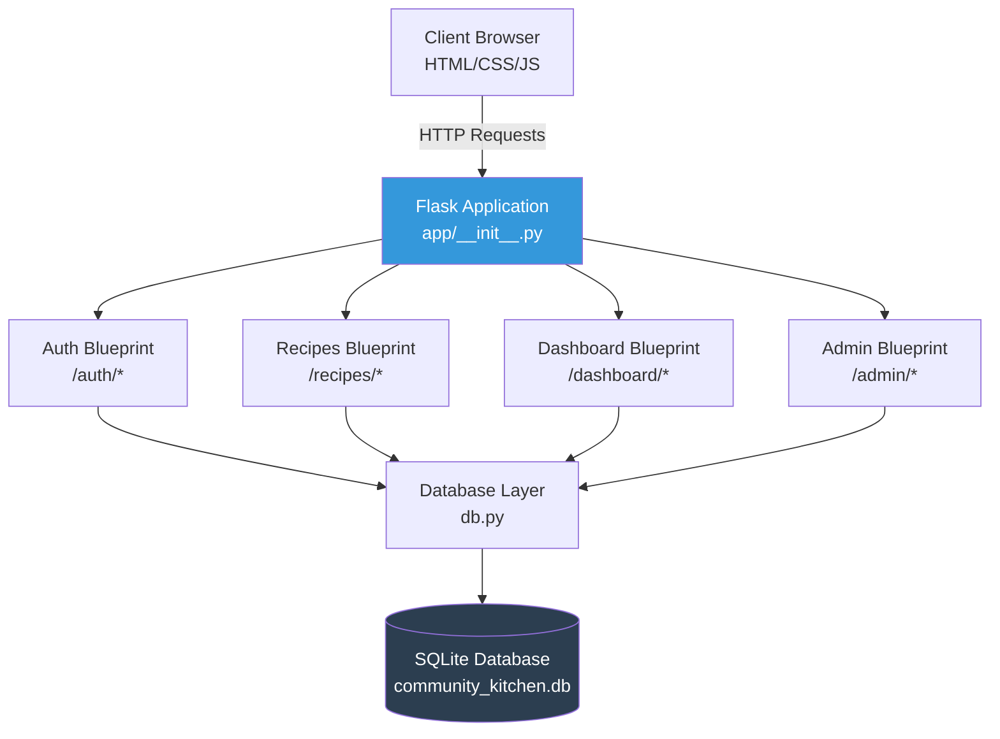
```mermaid
graph TB
    Client[Client Browser<br/>HTML/CSS/JS]
    Flask[Flask Application<br/>app/__init__.py]
    Auth[Auth Blueprint<br/>/auth/*]
    Recipes[Recipes Blueprint<br/>/recipes/*]
    Dashboard[Dashboard Blueprint<br/>/dashboard/*]
    Admin[Admin Blueprint<br/>/admin/*]
    DB[Database Layer<br/>db.py]
    SQLite[(SQLite Database<br/>community_kitchen.db)]
    
    Client -->|HTTP Requests| Flask
    Flask --> Auth
    Flask --> Recipes
    Flask --> Dashboard
    Flask --> Admin
    Auth --> DB
    Recipes --> DB
    Dashboard --> DB
    Admin --> DB
    DB --> SQLite
    
    style Flask fill:#3498db,color:#fff
    style SQLite fill:#2c3e50,color:#fff
```

## Database Schema ERD

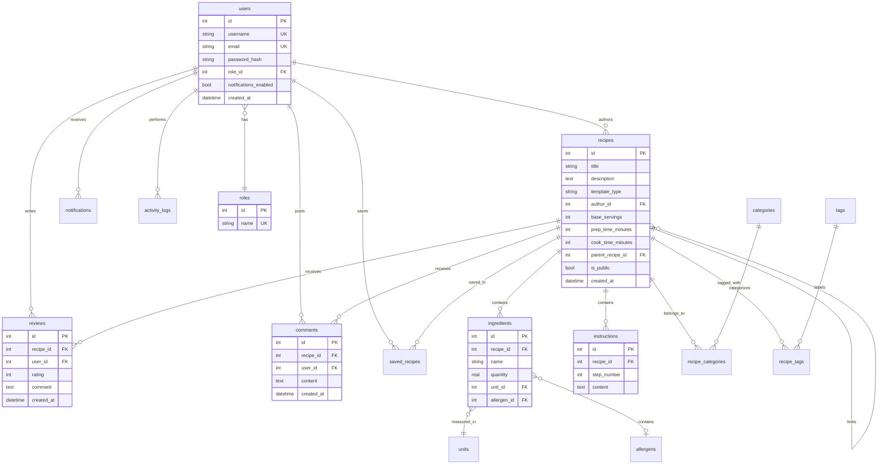
```mermaid
erDiagram
    users ||--o{ recipes : authors
    users ||--o{ reviews : writes
    users ||--o{ comments : posts
    users ||--o{ saved_recipes : saves
    users ||--o{ notifications : receives
    users ||--o{ activity_logs : performs
    users }o--|| roles : has
    
    recipes ||--o{ ingredients : contains
    recipes ||--o{ instructions : contains
    recipes ||--o{ reviews : receives
    recipes ||--o{ comments : receives
    recipes ||--o{ saved_recipes : saved_in
    recipes ||--o{ recipe_categories : belongs_to
    recipes ||--o{ recipe_tags : tagged_with
    recipes ||--o{ recipes : forks
    
    ingredients }o--|| units : measured_in
    ingredients }o--o| allergens : contains
    
    categories ||--o{ recipe_categories : categorizes
    tags ||--o{ recipe_tags : labels
    
    users {
        int id PK
        string username UK
        string email UK
        string password_hash
        int role_id FK
        bool notifications_enabled
        datetime created_at
    }
    
    roles {
        int id PK
        string name UK
    }
    
    recipes {
        int id PK
        string title
        text description
        string template_type
        int author_id FK
        int base_servings
        int prep_time_minutes
        int cook_time_minutes
        int parent_recipe_id FK
        bool is_public
        datetime created_at
    }
    
    ingredients {
        int id PK
        int recipe_id FK
        string name
        real quantity
        int unit_id FK
        int allergen_id FK
    }
    
    instructions {
        int id PK
        int recipe_id FK
        int step_number
        text content
    }
    
    reviews {
        int id PK
        int recipe_id FK
        int user_id FK
        int rating
        text comment
        datetime created_at
    }
    
    comments {
        int id PK
        int recipe_id FK
        int user_id FK
        text content
        datetime created_at
    }
```

## HTTP Routes Flow Diagram

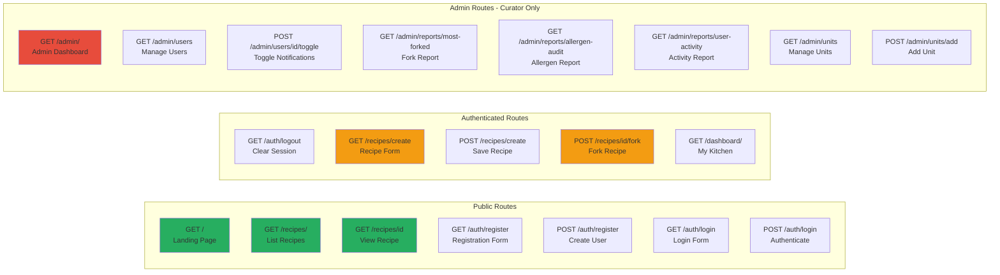
```mermaid
graph LR
    subgraph Public Routes
        Home[GET /<br/>Landing Page]
        RecipeList[GET /recipes/<br/>List Recipes]
        RecipeView[GET /recipes/id<br/>View Recipe]
        RegForm[GET /auth/register<br/>Registration Form]
        RegPost[POST /auth/register<br/>Create User]
        LoginForm[GET /auth/login<br/>Login Form]
        LoginPost[POST /auth/login<br/>Authenticate]
    end
    
    subgraph Authenticated Routes
        Logout[GET /auth/logout<br/>Clear Session]
        CreateForm[GET /recipes/create<br/>Recipe Form]
        CreatePost[POST /recipes/create<br/>Save Recipe]
        Fork[POST /recipes/id/fork<br/>Fork Recipe]
        MyKitchen[GET /dashboard/<br/>My Kitchen]
    end
    
    subgraph Admin Routes - Curator Only
        AdminHome[GET /admin/<br/>Admin Dashboard]
        Users[GET /admin/users<br/>Manage Users]
        ToggleNotif[POST /admin/users/id/toggle<br/>Toggle Notifications]
        MostForked[GET /admin/reports/most-forked<br/>Fork Report]
        AllergenAudit[GET /admin/reports/allergen-audit<br/>Allergen Report]
        UserActivity[GET /admin/reports/user-activity<br/>Activity Report]
        Units[GET /admin/units<br/>Manage Units]
        AddUnit[POST /admin/units/add<br/>Add Unit]
    end
    
    style Home fill:#27ae60
    style RecipeList fill:#27ae60
    style RecipeView fill:#27ae60
    style CreateForm fill:#f39c12
    style Fork fill:#f39c12
    style AdminHome fill:#e74c3c
```

## Request Flow: User Registration

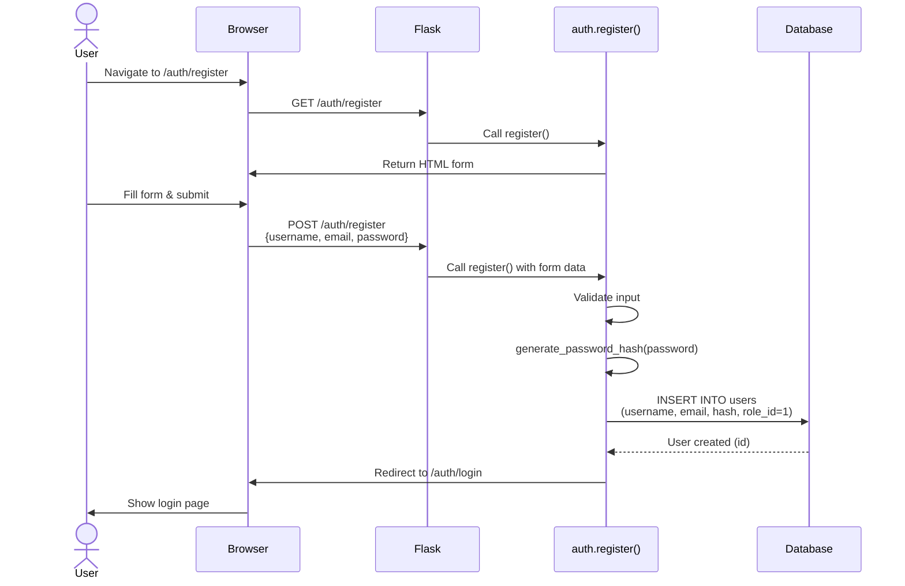
```mermaid
sequenceDiagram
    actor User
    participant Browser
    participant Flask
    participant Auth as auth.register()
    participant DB as Database
    
    User->>Browser: Navigate to /auth/register
    Browser->>Flask: GET /auth/register
    Flask->>Auth: Call register()
    Auth->>Browser: Return HTML form
    
    User->>Browser: Fill form & submit
    Browser->>Flask: POST /auth/register<br/>{username, email, password}
    Flask->>Auth: Call register() with form data
    Auth->>Auth: Validate input
    Auth->>Auth: generate_password_hash(password)
    Auth->>DB: INSERT INTO users<br/>(username, email, hash, role_id=1)
    DB-->>Auth: User created (id)
    Auth->>Browser: Redirect to /auth/login
    Browser->>User: Show login page
```

## Request Flow: Creating a Recipe

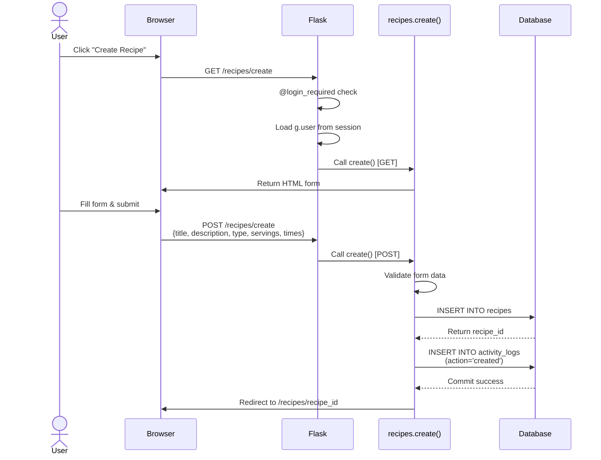
```mermaid
sequenceDiagram
    actor User
    participant Browser
    participant Flask
    participant Recipes as recipes.create()
    participant DB as Database
    
    User->>Browser: Click "Create Recipe"
    Browser->>Flask: GET /recipes/create
    Flask->>Flask: @login_required check
    Flask->>Flask: Load g.user from session
    Flask->>Recipes: Call create() [GET]
    Recipes->>Browser: Return HTML form
    
    User->>Browser: Fill form & submit
    Browser->>Flask: POST /recipes/create<br/>{title, description, type, servings, times}
    Flask->>Recipes: Call create() [POST]
    Recipes->>Recipes: Validate form data
    Recipes->>DB: INSERT INTO recipes
    DB-->>Recipes: Return recipe_id
    Recipes->>DB: INSERT INTO activity_logs<br/>(action='created')
    DB-->>Recipes: Commit success
    Recipes->>Browser: Redirect to /recipes/recipe_id
```

## Request Flow: Forking a Recipe

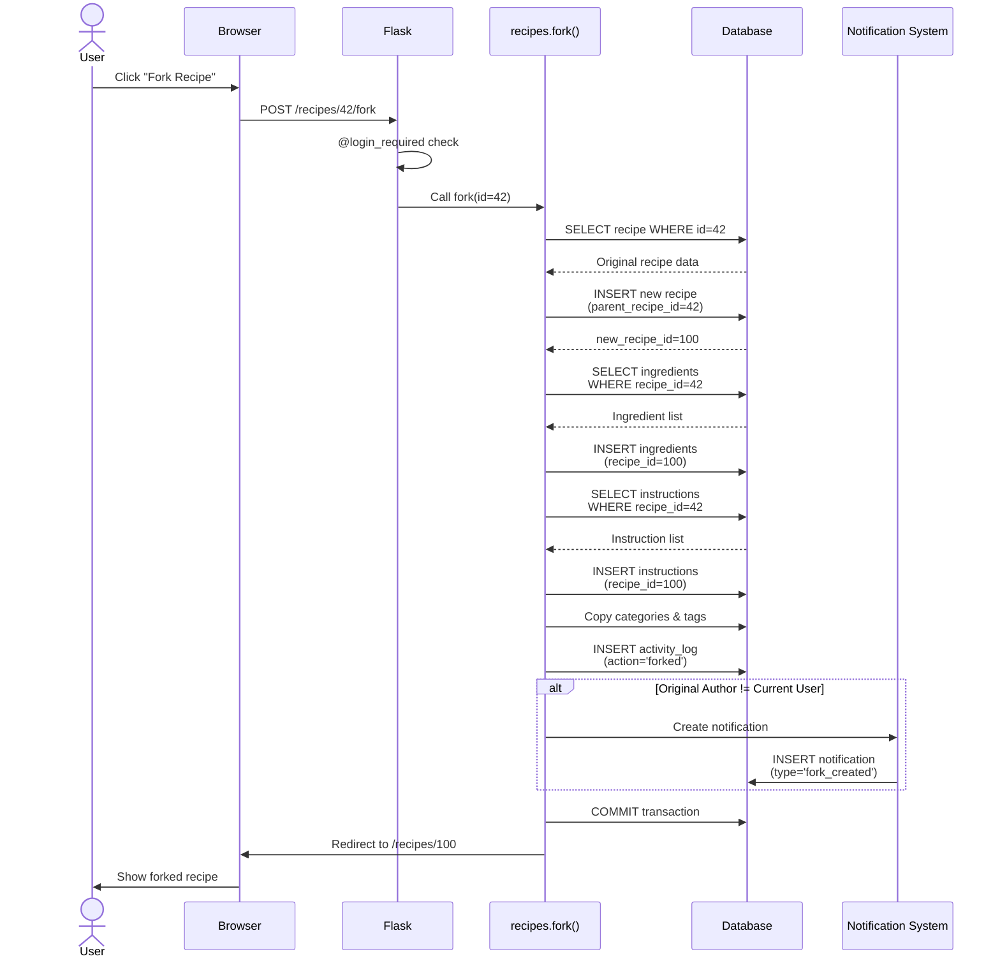
```mermaid
sequenceDiagram
    actor User
    participant Browser
    participant Flask
    participant Recipes as recipes.fork()
    participant DB as Database
    participant Notif as Notification System
    
    User->>Browser: Click "Fork Recipe"
    Browser->>Flask: POST /recipes/42/fork
    Flask->>Flask: @login_required check
    Flask->>Recipes: Call fork(id=42)
    
    Recipes->>DB: SELECT recipe WHERE id=42
    DB-->>Recipes: Original recipe data
    
    Recipes->>DB: INSERT new recipe<br/>(parent_recipe_id=42)
    DB-->>Recipes: new_recipe_id=100
    
    Recipes->>DB: SELECT ingredients<br/>WHERE recipe_id=42
    DB-->>Recipes: Ingredient list
    Recipes->>DB: INSERT ingredients<br/>(recipe_id=100)
    
    Recipes->>DB: SELECT instructions<br/>WHERE recipe_id=42
    DB-->>Recipes: Instruction list
    Recipes->>DB: INSERT instructions<br/>(recipe_id=100)
    
    Recipes->>DB: Copy categories & tags
    
    Recipes->>DB: INSERT activity_log<br/>(action='forked')
    
    alt Original Author != Current User
        Recipes->>Notif: Create notification
        Notif->>DB: INSERT notification<br/>(type='fork_created')
    end
    
    Recipes->>DB: COMMIT transaction
    Recipes->>Browser: Redirect to /recipes/100
    Browser->>User: Show forked recipe
```

## Recipe Fork Lineage

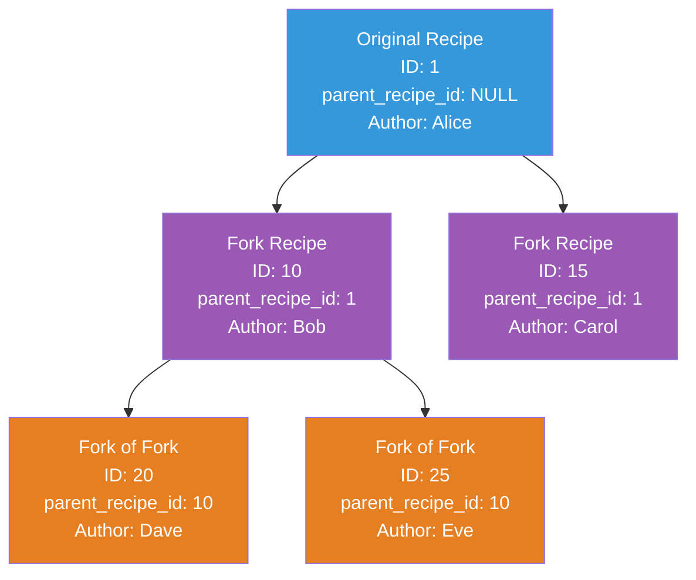
```mermaid
graph TB
    Original[Original Recipe<br/>ID: 1<br/>parent_recipe_id: NULL<br/>Author: Alice]
    
    Fork1[Fork Recipe<br/>ID: 10<br/>parent_recipe_id: 1<br/>Author: Bob]
    
    Fork2[Fork Recipe<br/>ID: 15<br/>parent_recipe_id: 1<br/>Author: Carol]
    
    Fork3[Fork of Fork<br/>ID: 20<br/>parent_recipe_id: 10<br/>Author: Dave]
    
    Fork4[Fork of Fork<br/>ID: 25<br/>parent_recipe_id: 10<br/>Author: Eve]
    
    Original --> Fork1
    Original --> Fork2
    Fork1 --> Fork3
    Fork1 --> Fork4
    
    style Original fill:#3498db,color:#fff
    style Fork1 fill:#9b59b6,color:#fff
    style Fork2 fill:#9b59b6,color:#fff
    style Fork3 fill:#e67e22,color:#fff
    style Fork4 fill:#e67e22,color:#fff
```

## User Dashboard Data Flow

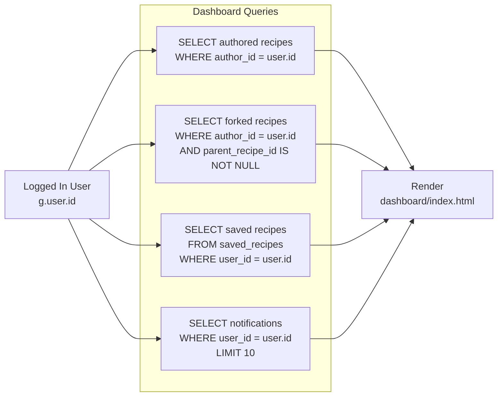
```mermaid
graph LR
    User[Logged In User<br/>g.user.id]
    
    subgraph Dashboard Queries
        Q1[SELECT authored recipes<br/>WHERE author_id = user.id]
        Q2[SELECT forked recipes<br/>WHERE author_id = user.id<br/>AND parent_recipe_id IS NOT NULL]
        Q3[SELECT saved recipes<br/>FROM saved_recipes<br/>WHERE user_id = user.id]
        Q4[SELECT notifications<br/>WHERE user_id = user.id<br/>LIMIT 10]
    end
    
    Template[Render<br/>dashboard/index.html]
    
    User --> Q1
    User --> Q2
    User --> Q3
    User --> Q4
    
    Q1 --> Template
    Q2 --> Template
    Q3 --> Template
    Q4 --> Template
```

## Admin Reports Architecture

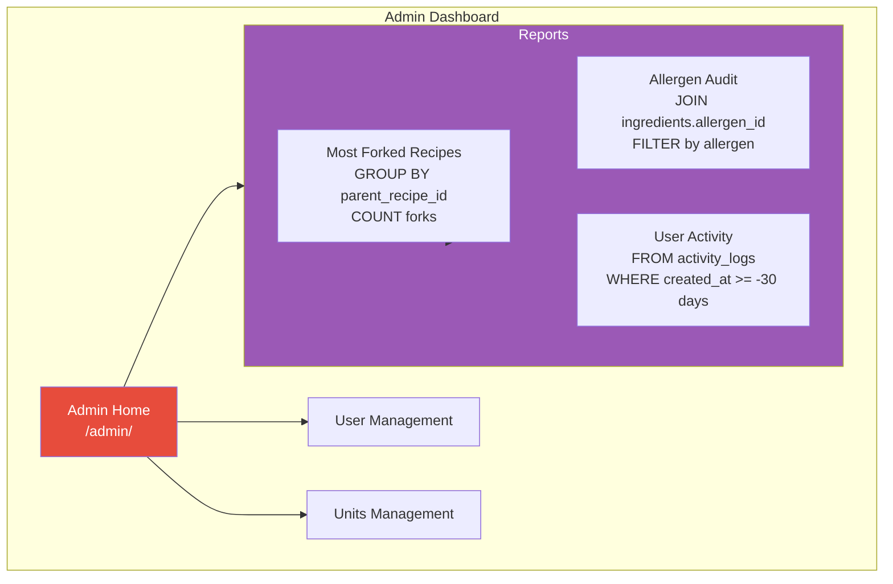
```mermaid
graph TB
    subgraph Admin Dashboard
        AdminHome[Admin Home<br/>/admin/]
        Users[User Management]
        Reports[Reports Hub]
        Units[Units Management]
    end
    
    subgraph Reports
        MostForked[Most Forked Recipes<br/>GROUP BY parent_recipe_id<br/>COUNT forks]
        AllergenAudit[Allergen Audit<br/>JOIN ingredients.allergen_id<br/>FILTER by allergen]
        UserActivity[User Activity<br/>FROM activity_logs<br/>WHERE created_at >= -30 days]
    end
    
    AdminHome --> Users
    AdminHome --> Reports
    AdminHome --> Units
    
    Reports --> MostForked
    Reports --> AllergenAudit
    Reports --> UserActivity
    
    style AdminHome fill:#e74c3c,color:#fff
    style Reports fill:#9b59b6,color:#fff
```

## Complete Blueprint Structure

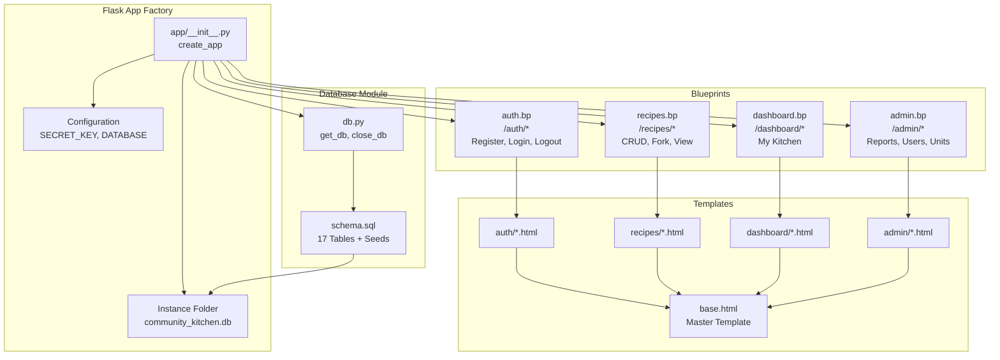
```mermaid
graph TB
    subgraph Flask App Factory
        AppInit[app/__init__.py<br/>create_app]
        Config[Configuration<br/>SECRET_KEY, DATABASE]
        Instance[Instance Folder<br/>community_kitchen.db]
    end
    
    subgraph Blueprints
        direction TB
        Auth[auth.bp<br/>/auth/*<br/>Register, Login, Logout]
        Recipes[recipes.bp<br/>/recipes/*<br/>CRUD, Fork, View]
        Dashboard[dashboard.bp<br/>/dashboard/*<br/>My Kitchen]
        Admin[admin.bp<br/>/admin/*<br/>Reports, Users, Units]
    end
    
    subgraph Database Module
        DBPy[db.py<br/>get_db, close_db]
        Schema[schema.sql<br/>17 Tables + Seeds]
    end
    
    subgraph Templates
        Base[base.html<br/>Master Template]
        AuthT[auth/*.html]
        RecipesT[recipes/*.html]
        DashT[dashboard/*.html]
        AdminT[admin/*.html]
    end
    
    AppInit --> Config
    AppInit --> Instance
    AppInit --> Auth
    AppInit --> Recipes
    AppInit --> Dashboard
    AppInit --> Admin
    AppInit --> DBPy
    
    DBPy --> Schema
    Schema --> Instance
    
    Auth --> AuthT
    Recipes --> RecipesT
    Dashboard --> DashT
    Admin --> AdminT
    
    AuthT --> Base
    RecipesT --> Base
    DashT --> Base
    AdminT --> Base
```

## HTTP Methods by Blueprint

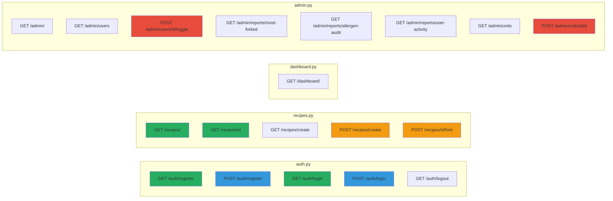
```mermaid
graph LR
    subgraph auth.py
        A1[GET /auth/register]
        A2[POST /auth/register]
        A3[GET /auth/login]
        A4[POST /auth/login]
        A5[GET /auth/logout]
    end
    
    subgraph recipes.py
        R1[GET /recipes/]
        R2[GET /recipes/id]
        R3[GET /recipes/create]
        R4[POST /recipes/create]
        R5[POST /recipes/id/fork]
    end
    
    subgraph dashboard.py
        D1[GET /dashboard/]
    end
    
    subgraph admin.py
        AD1[GET /admin/]
        AD2[GET /admin/users]
        AD3[POST /admin/users/id/toggle]
        AD4[GET /admin/reports/most-forked]
        AD5[GET /admin/reports/allergen-audit]
        AD6[GET /admin/reports/user-activity]
        AD7[GET /admin/units]
        AD8[POST /admin/units/add]
    end
    
    style A1 fill:#27ae60
    style A3 fill:#27ae60
    style R1 fill:#27ae60
    style R2 fill:#27ae60
    style A2 fill:#3498db
    style A4 fill:#3498db
    style R4 fill:#f39c12
    style R5 fill:#f39c12
    style AD3 fill:#e74c3c
    style AD8 fill:#e74c3c
```

## Recipe Creation Flow

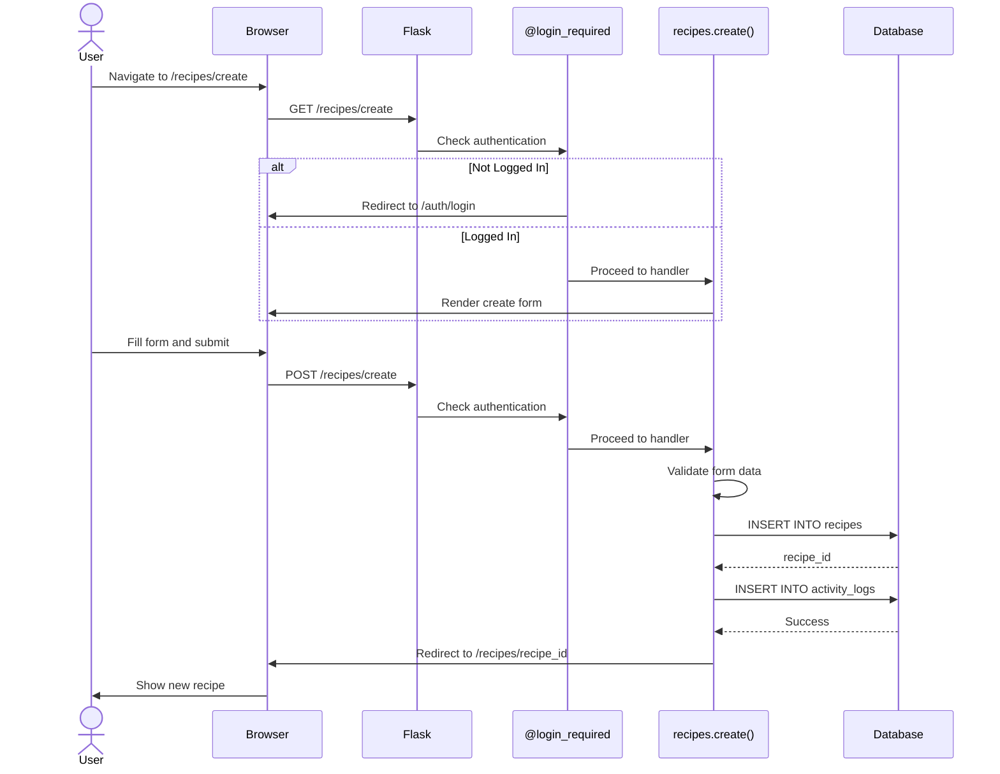
```mermaid
sequenceDiagram
    actor User
    participant Browser
    participant Flask
    participant Decorator as @login_required
    participant Handler as recipes.create()
    participant DB as Database
    
    User->>Browser: Navigate to /recipes/create
    Browser->>Flask: GET /recipes/create
    Flask->>Decorator: Check authentication
    
    alt Not Logged In
        Decorator->>Browser: Redirect to /auth/login
    else Logged In
        Decorator->>Handler: Proceed to handler
        Handler->>Browser: Render create form
    end
    
    User->>Browser: Fill form and submit
    Browser->>Flask: POST /recipes/create
    Flask->>Decorator: Check authentication
    Decorator->>Handler: Proceed to handler
    Handler->>Handler: Validate form data
    Handler->>DB: INSERT INTO recipes
    DB-->>Handler: recipe_id
    Handler->>DB: INSERT INTO activity_logs
    DB-->>Handler: Success
    Handler->>Browser: Redirect to /recipes/recipe_id
    Browser->>User: Show new recipe
```

## Recipe Fork Flow with Notifications

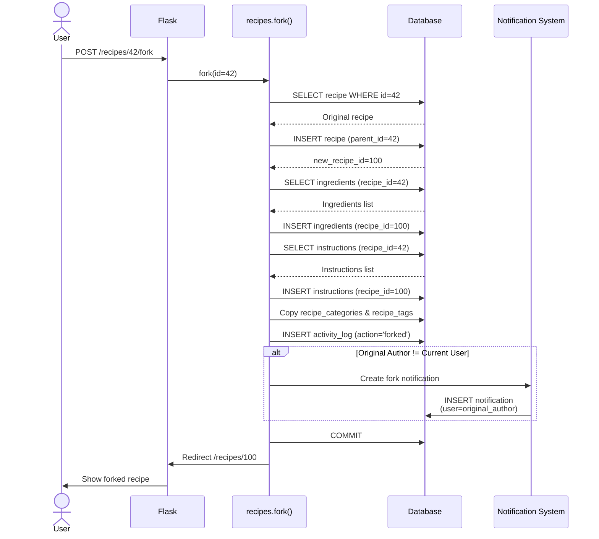
```mermaid
sequenceDiagram
    actor User
    participant Flask
    participant Handler as recipes.fork()
    participant DB as Database
    participant Notif as Notification System
    
    User->>Flask: POST /recipes/42/fork
    Flask->>Handler: fork(id=42)
    
    Handler->>DB: SELECT recipe WHERE id=42
    DB-->>Handler: Original recipe
    
    Handler->>DB: INSERT recipe (parent_id=42)
    DB-->>Handler: new_recipe_id=100
    
    Handler->>DB: SELECT ingredients (recipe_id=42)
    DB-->>Handler: Ingredients list
    Handler->>DB: INSERT ingredients (recipe_id=100)
    
    Handler->>DB: SELECT instructions (recipe_id=42)
    DB-->>Handler: Instructions list
    Handler->>DB: INSERT instructions (recipe_id=100)
    
    Handler->>DB: Copy recipe_categories & recipe_tags
    Handler->>DB: INSERT activity_log (action='forked')
    
    alt Original Author != Current User
        Handler->>Notif: Create fork notification
        Notif->>DB: INSERT notification<br/>(user=original_author)
    end
    
    Handler->>DB: COMMIT
    Handler->>Flask: Redirect /recipes/100
    Flask->>User: Show forked recipe
```

## Database Table Relationships

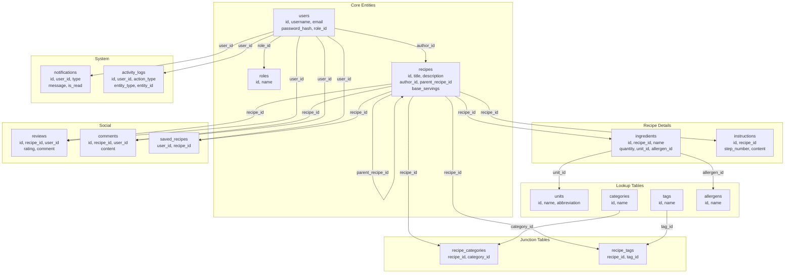
```mermaid
graph TB
    subgraph Core Entities
        Users[users<br/>id, username, email<br/>password_hash, role_id]
        Roles[roles<br/>id, name]
        Recipes[recipes<br/>id, title, description<br/>author_id, parent_recipe_id<br/>base_servings]
    end
    
    subgraph Recipe Details
        Ingredients[ingredients<br/>id, recipe_id, name<br/>quantity, unit_id, allergen_id]
        Instructions[instructions<br/>id, recipe_id<br/>step_number, content]
    end
    
    subgraph Lookup Tables
        Units[units<br/>id, name, abbreviation]
        Categories[categories<br/>id, name]
        Tags[tags<br/>id, name]
        Allergens[allergens<br/>id, name]
    end
    
    subgraph Junction Tables
        RecipeCat[recipe_categories<br/>recipe_id, category_id]
        RecipeTag[recipe_tags<br/>recipe_id, tag_id]
    end
    
    subgraph Social
        Reviews[reviews<br/>id, recipe_id, user_id<br/>rating, comment]
        Comments[comments<br/>id, recipe_id, user_id<br/>content]
        Saved[saved_recipes<br/>user_id, recipe_id]
    end
    
    subgraph System
        Notifications[notifications<br/>id, user_id, type<br/>message, is_read]
        ActivityLogs[activity_logs<br/>id, user_id, action_type<br/>entity_type, entity_id]
    end
    
    Users -->|role_id| Roles
    Users -->|author_id| Recipes
    Recipes -->|parent_recipe_id| Recipes
    Recipes -->|recipe_id| Ingredients
    Recipes -->|recipe_id| Instructions
    Recipes -->|recipe_id| RecipeCat
    Recipes -->|recipe_id| RecipeTag
    Recipes -->|recipe_id| Reviews
    Recipes -->|recipe_id| Comments
    
    Ingredients -->|unit_id| Units
    Ingredients -->|allergen_id| Allergens
    
    Categories -->|category_id| RecipeCat
    Tags -->|tag_id| RecipeTag
    
    Users -->|user_id| Reviews
    Users -->|user_id| Comments
    Users -->|user_id| Saved
    Users -->|user_id| Notifications
    Users -->|user_id| ActivityLogs
    
    Recipes -->|recipe_id| Saved
```

## Dynamic Ingredient Scaling

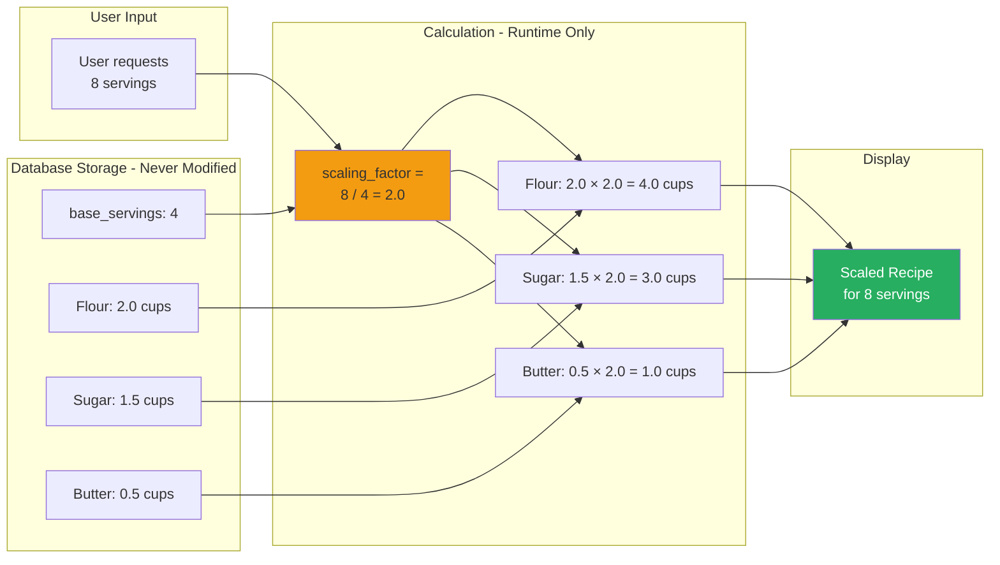
```mermaid
flowchart LR
    subgraph Database Storage - Never Modified
        BaseServings[base_servings: 4]
        Ing1[Flour: 2.0 cups]
        Ing2[Sugar: 1.5 cups]
        Ing3[Butter: 0.5 cups]
    end
    
    subgraph User Input
        Request[User requests<br/>8 servings]
    end
    
    subgraph Calculation - Runtime Only
        Factor[scaling_factor =<br/>8 / 4 = 2.0]
        Scale1[Flour: 2.0 × 2.0 = 4.0 cups]
        Scale2[Sugar: 1.5 × 2.0 = 3.0 cups]
        Scale3[Butter: 0.5 × 2.0 = 1.0 cups]
    end
    
    subgraph Display
        Result[Scaled Recipe<br/>for 8 servings]
    end
    
    BaseServings --> Factor
    Request --> Factor
    
    Factor --> Scale1
    Factor --> Scale2
    Factor --> Scale3
    
    Ing1 --> Scale1
    Ing2 --> Scale2
    Ing3 --> Scale3
    
    Scale1 --> Result
    Scale2 --> Result
    Scale3 --> Result
    
    style Factor fill:#f39c12
    style Result fill:#27ae60,color:#fff
```

## Social Interaction Flow

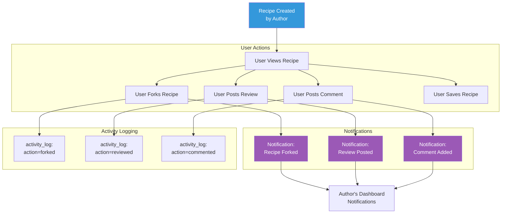
```mermaid
graph TB
    Recipe[Recipe Created<br/>by Author]
    
    subgraph User Actions
        View[User Views Recipe]
        Fork[User Forks Recipe]
        Review[User Posts Review]
        Comment[User Posts Comment]
        Save[User Saves Recipe]
    end
    
    subgraph Notifications
        ForkNotif[Notification:<br/>Recipe Forked]
        ReviewNotif[Notification:<br/>Review Posted]
        CommentNotif[Notification:<br/>Comment Added]
    end
    
    subgraph Activity Logging
        LogFork[activity_log:<br/>action=forked]
        LogReview[activity_log:<br/>action=reviewed]
        LogComment[activity_log:<br/>action=commented]
    end
    
    Recipe --> View
    View --> Fork
    View --> Review
    View --> Comment
    View --> Save
    
    Fork --> ForkNotif
    Fork --> LogFork
    
    Review --> ReviewNotif
    Review --> LogReview
    
    Comment --> CommentNotif
    Comment --> LogComment
    
    ForkNotif --> AuthorDash[Author's Dashboard<br/>Notifications]
    ReviewNotif --> AuthorDash
    CommentNotif --> AuthorDash
    
    style Recipe fill:#3498db,color:#fff
    style ForkNotif fill:#9b59b6,color:#fff
    style ReviewNotif fill:#9b59b6,color:#fff
    style CommentNotif fill:#9b59b6,color:#fff
```

## Security Layers

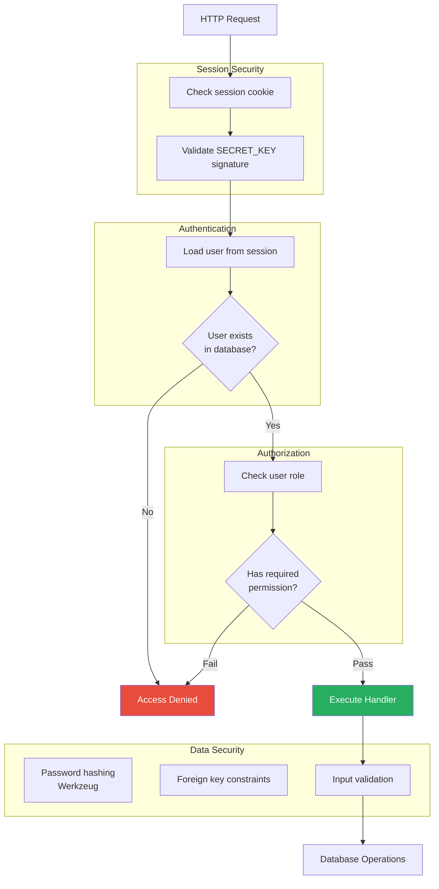
```mermaid
graph TB
    Request[HTTP Request]
    
    subgraph Session Security
        SessionCheck[Check session cookie]
        ValidateSignature[Validate SECRET_KEY signature]
    end
    
    subgraph Authentication
        LoadUser[Load user from session]
        CheckExists{User exists<br/>in database?}
    end
    
    subgraph Authorization
        RoleCheck[Check user role]
        PermissionCheck{Has required<br/>permission?}
    end
    
    subgraph Data Security
        PasswordHash[Password hashing<br/>Werkzeug]
        ForeignKeys[Foreign key constraints]
        InputValidation[Input validation]
    end
    
    Request --> SessionCheck
    SessionCheck --> ValidateSignature
    ValidateSignature --> LoadUser
    LoadUser --> CheckExists
    
    CheckExists -->|Yes| RoleCheck
    CheckExists -->|No| Deny[Access Denied]
    
    RoleCheck --> PermissionCheck
    PermissionCheck -->|Pass| Allow[Execute Handler]
    PermissionCheck -->|Fail| Deny
    
    Allow --> InputValidation
    InputValidation --> Execute[Database Operations]
    
    style Allow fill:#27ae60,color:#fff
    style Deny fill:#e74c3c,color:#fff
```

## Data Flow: Landing Page

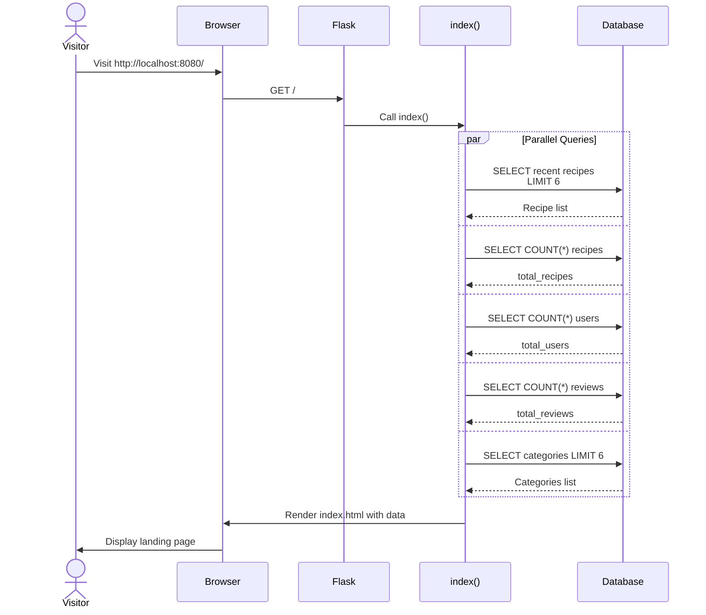
```mermaid
sequenceDiagram
    actor Visitor
    participant Browser
    participant Flask
    participant Index as index()
    participant DB as Database
    
    Visitor->>Browser: Visit http://localhost:8080/
    Browser->>Flask: GET /
    Flask->>Index: Call index()
    
    par Parallel Queries
        Index->>DB: SELECT recent recipes<br/>LIMIT 6
        DB-->>Index: Recipe list
    and
        Index->>DB: SELECT COUNT(*) recipes
        DB-->>Index: total_recipes
    and
        Index->>DB: SELECT COUNT(*) users
        DB-->>Index: total_users
    and
        Index->>DB: SELECT COUNT(*) reviews
        DB-->>Index: total_reviews
    and
        Index->>DB: SELECT categories LIMIT 6
        DB-->>Index: Categories list
    end
    
    Index->>Browser: Render index.html with data
    Browser->>Visitor: Display landing page
```

## Deployment Architecture

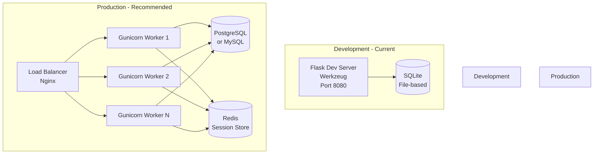
```mermaid
graph TB
    subgraph Development - Current
        DevServer[Flask Dev Server<br/>Werkzeug<br/>Port 8080]
        DevDB[(SQLite<br/>File-based)]
    end
    
    subgraph Production - Recommended
        LB[Load Balancer<br/>Nginx]
        App1[Gunicorn Worker 1]
        App2[Gunicorn Worker 2]
        App3[Gunicorn Worker N]
        ProdDB[(PostgreSQL<br/>or MySQL)]
        Redis[(Redis<br/>Session Store)]
    end
    
    DevServer --> DevDB
    
    LB --> App1
    LB --> App2
    LB --> App3
    
    App1 --> ProdDB
    App2 --> ProdDB
    App3 --> ProdDB
    
    App1 --> Redis
    App2 --> Redis
    App3 --> Redis
    
    style Development - Current fill:#f39c12
    style Production - Recommended fill:#27ae60
```

## Complete System Context

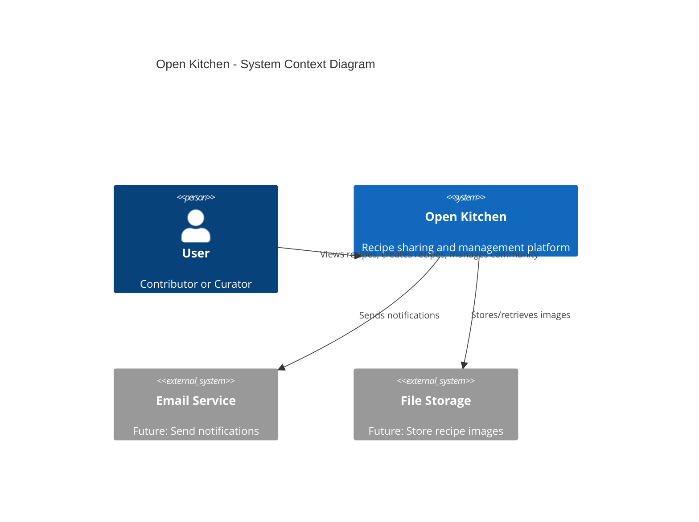
```mermaid
C4Context
    title Open Kitchen - System Context Diagram
    
    Person(user, "User", "Contributor or Curator")
    System(openkitchen, "Open Kitchen", "Recipe sharing and management platform")
    System_Ext(email, "Email Service", "Future: Send notifications")
    System_Ext(storage, "File Storage", "Future: Store recipe images")
    
    Rel(user, openkitchen, "Views recipes, creates recipes, manages community")
    Rel(openkitchen, email, "Sends notifications")
    Rel(openkitchen, storage, "Stores/retrieves images")
```

## Component Diagram

```mermaid
graph TB
    subgraph Web Layer
        Templates[Jinja2 Templates<br/>HTML/CSS]
        Static[Static Assets<br/>Future: CSS/JS files]
    end
    
    subgraph Application Layer
        Factory[Application Factory<br/>create_app]
        AuthBP[Auth Blueprint]
        RecipesBP[Recipes Blueprint]
        DashBP[Dashboard Blueprint]
        AdminBP[Admin Blueprint]
    end
    
    subgraph Data Access Layer
        DBModule[db.py<br/>Connection Management]
        Schema[schema.sql<br/>DDL & Seed Data]
    end
    
    subgraph Persistence Layer
        SQLite[(SQLite Database<br/>community_kitchen.db<br/>17 Tables)]
    end
    
    Templates --> AuthBP
    Templates --> RecipesBP
    Templates --> DashBP
    Templates --> AdminBP
    
    Factory --> AuthBP
    Factory --> RecipesBP
    Factory --> DashBP
    Factory --> AdminBP
    
    AuthBP --> DBModule
    RecipesBP --> DBModule
    DashBP --> DBModule
    AdminBP --> DBModule
    
    DBModule --> Schema
    Schema --> SQLite
    
    style Factory fill:#3498db,color:#fff
    style SQLite fill:#2c3e50,color:#fff
```
