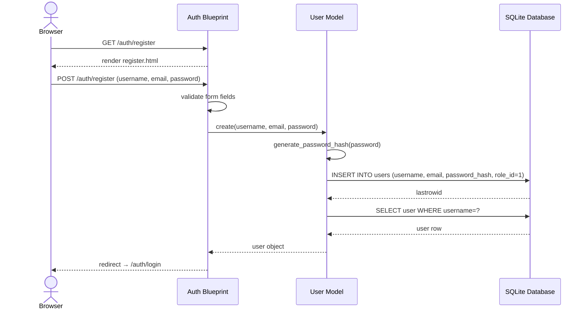
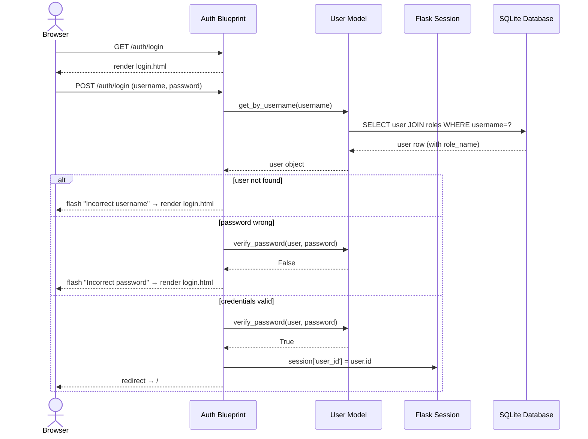
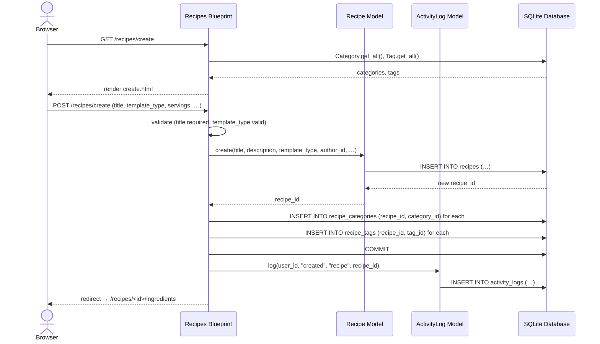
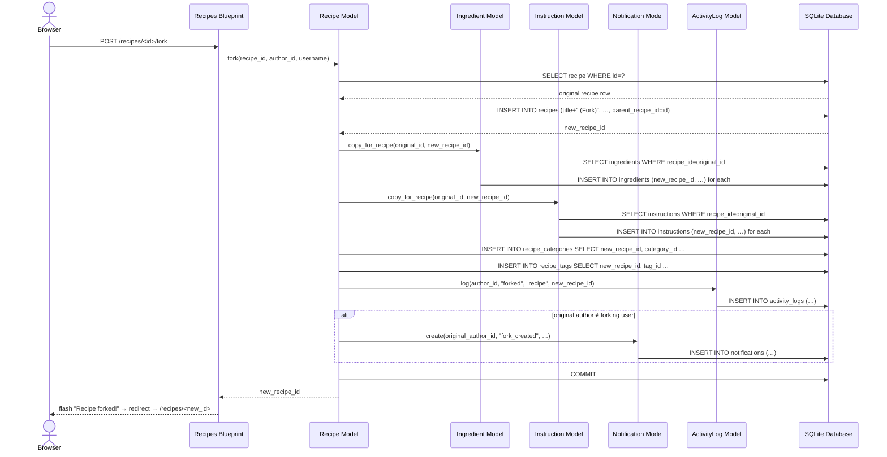
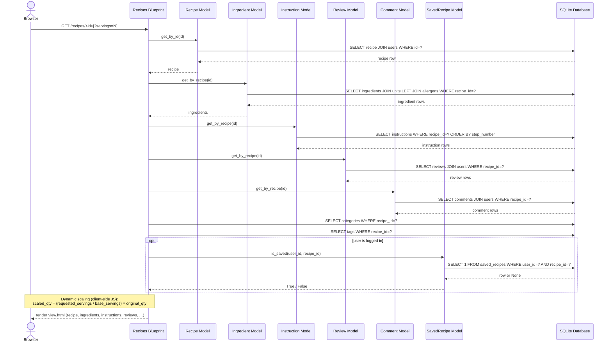
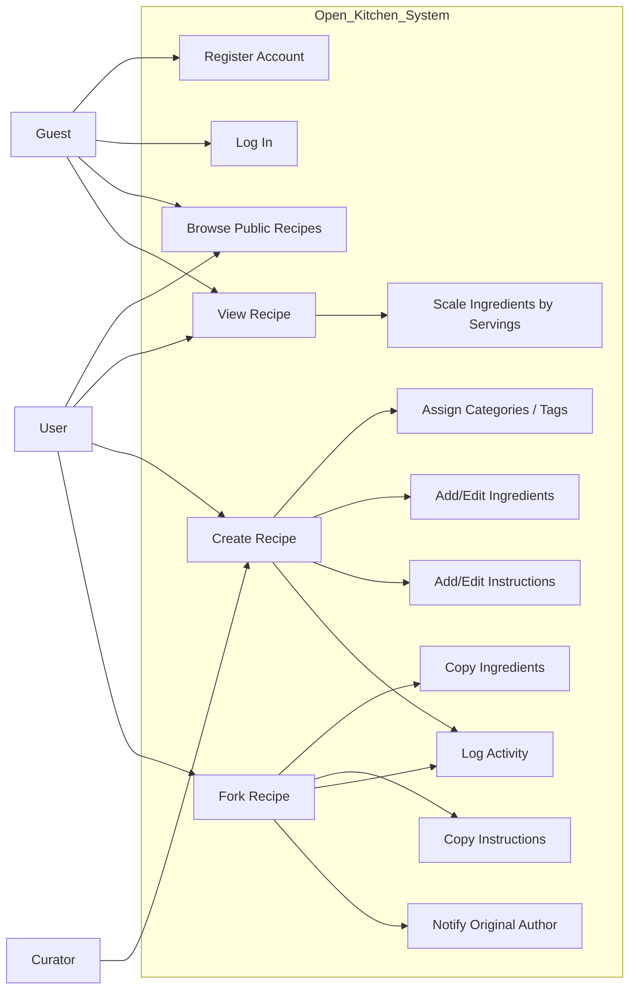

# Open Kitchen – Class & Sequence Diagrams

## 1. Class Diagram

The class diagram below covers every model class, the Flask blueprints, and the
key relationships derived from the database schema and Python source code.

```mermaid
classDiagram
    %% ── Blueprint / Controller layer ──────────────────────────────────────────
    class AuthBlueprint {
        +register()
        +login()
        +logout()
        +load_logged_in_user()
        +login_required(view)
        +curator_required(view)
    }

    class RecipesBlueprint {
        +index()
        +view(id)
        +create()
        +edit_ingredients(id)
        +edit_instructions(id)
        +delete_ingredient(id)
        +delete_instruction(id)
        +fork(id)
        +save(id)
    }

    class DashboardBlueprint {
        +index()
    }

    class AdminBlueprint {
        +index()
        +users()
        +toggle_notifications(id)
        +most_forked()
        +allergen_audit()
        +user_activity()
        +units()
        +add_unit()
    }

    %% ── Model layer ────────────────────────────────────────────────────────────
    class User {
        +int id
        +str username
        +str email
        +str password_hash
        +int role_id
        +int notifications_enabled
        +datetime created_at
        +datetime updated_at
        +create(username, email, password, role_id)$
        +get_by_id(user_id)$
        +get_by_username(username)$
        +get_all()$
        +verify_password(user, password)$
        +toggle_notifications(user_id)$
    }

    class Role {
        +int id
        +str name
        +get_all()$
        +get_by_name(name)$
    }

    class Recipe {
        +int id
        +str title
        +str description
        +str template_type
        +int author_id
        +int base_servings
        +int prep_time_minutes
        +int cook_time_minutes
        +int parent_recipe_id
        +int is_public
        +datetime created_at
        +datetime updated_at
        +create(title, description, template_type, author_id, ...)$
        +get_by_id(recipe_id)$
        +get_all_public(filters)$
        +get_by_author(author_id)$
        +get_forked_by_author(author_id)$
        +fork(recipe_id, author_id, username)$
        +get_recent(limit)$
        +get_stats()$
    }

    class Ingredient {
        +int id
        +int recipe_id
        +str name
        +float quantity
        +int unit_id
        +int allergen_id
        +get_by_recipe(recipe_id)$
        +copy_for_recipe(source_recipe_id, target_recipe_id)$
    }

    class Instruction {
        +int id
        +int recipe_id
        +int step_number
        +str content
        +get_by_recipe(recipe_id)$
        +copy_for_recipe(source_recipe_id, target_recipe_id)$
    }

    class Review {
        +int id
        +int recipe_id
        +int user_id
        +int rating
        +str comment
        +datetime created_at
        +get_by_recipe(recipe_id)$
    }

    class Comment {
        +int id
        +int recipe_id
        +int user_id
        +str content
        +datetime created_at
        +get_by_recipe(recipe_id)$
    }

    class SavedRecipe {
        +int user_id
        +int recipe_id
        +datetime saved_at
        +get_by_user(user_id)$
        +is_saved(user_id, recipe_id)$
        +save(user_id, recipe_id)$
        +unsave(user_id, recipe_id)$
    }

    class Unit {
        +int id
        +str name
        +str abbreviation
        +get_all()$
        +create(name, abbreviation)$
    }

    class Category {
        +int id
        +str name
        +get_all()$
    }

    class Tag {
        +int id
        +str name
        +get_all()$
    }

    class Allergen {
        +int id
        +str name
        +get_all()$
    }

    class Notification {
        +int id
        +int user_id
        +str type
        +int reference_id
        +str message
        +int is_read
        +datetime created_at
        +create(user_id, type, reference_id, message)$
        +get_by_user(user_id, limit)$
    }

    class ActivityLog {
        +int id
        +int user_id
        +str action_type
        +str entity_type
        +int entity_id
        +datetime created_at
        +log(user_id, action_type, entity_type, entity_id)$
        +get_user_activity_report(days)$
    }

    class Report {
        +most_forked_recipes()$
        +recipes_with_allergen(allergen_id)$
    }

    class Friendship {
        +int id
        +int requester_id
        +int addressee_id
        +str status
        +datetime created_at
    }

    %% ── Blueprint ↔ Model dependencies ────────────────────────────────────────
    AuthBlueprint ..> User : uses
    RecipesBlueprint ..> Recipe : uses
    RecipesBlueprint ..> Ingredient : uses
    RecipesBlueprint ..> Instruction : uses
    RecipesBlueprint ..> Review : uses
    RecipesBlueprint ..> Comment : uses
    RecipesBlueprint ..> SavedRecipe : uses
    RecipesBlueprint ..> Unit : uses
    RecipesBlueprint ..> Allergen : uses
    RecipesBlueprint ..> Category : uses
    RecipesBlueprint ..> Tag : uses
    RecipesBlueprint ..> ActivityLog : uses
    DashboardBlueprint ..> Recipe : uses
    DashboardBlueprint ..> SavedRecipe : uses
    DashboardBlueprint ..> Notification : uses
    AdminBlueprint ..> User : uses
    AdminBlueprint ..> Unit : uses
    AdminBlueprint ..> Allergen : uses
    AdminBlueprint ..> ActivityLog : uses
    AdminBlueprint ..> Report : uses

    %% ── Model associations (mirrors DB foreign keys) ──────────────────────────
    User "1" --> "1" Role : has role
    User "1" --> "0..*" Recipe : authors
    User "1" --> "0..*" Review : writes
    User "1" --> "0..*" Comment : posts
    User "1" --> "0..*" SavedRecipe : saves
    User "1" --> "0..*" Notification : receives
    User "1" --> "0..*" ActivityLog : generates
    User "1" --> "0..*" Friendship : initiates (requester)
    User "1" --> "0..*" Friendship : receives (addressee)

    Recipe "1" --> "0..*" Ingredient : contains
    Recipe "1" --> "0..*" Instruction : has steps
    Recipe "1" --> "0..*" Review : receives
    Recipe "1" --> "0..*" Comment : has
    Recipe "1" --> "0..*" SavedRecipe : saved by
    Recipe "0..1" --> "0..*" Recipe : forked as (parent_recipe_id)
    Recipe "0..*" --> "0..*" Category : classified in
    Recipe "0..*" --> "0..*" Tag : tagged with

    Ingredient --> Unit : measured in
    Ingredient --> "0..1" Allergen : may contain
```

---

## 2. Sequence Diagrams

### 2a. User Registration

---

### 2b. User Login

---

### 2c. Recipe Creation

---

### 2d. Recipe Forking

---

### 2e. Viewing a Recipe (with dynamic ingredient scaling)

### 2a. Recipe Authoring & Forking (Use Case Scenario)

